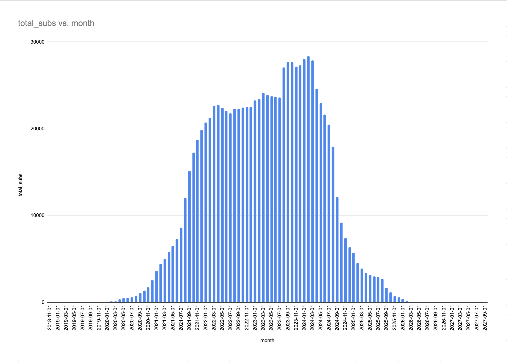
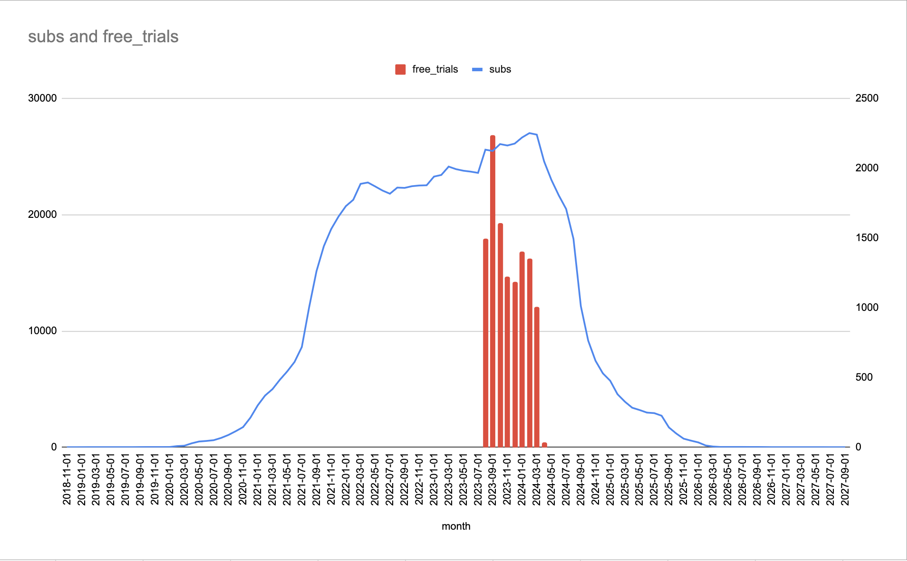

##### Start and stop PostgreSQL

```bash
$ pg_ctl -D /usr/local/var/postgres start
$ pg_ctl -D /usr/local/var/postgres stop
```

# Cleaning the data

`users.csv` is not formatted properly:

- `id` is a `float` when it should be an `int`
- there are 2 `created_at` columns (removing the 2nd one)

```csv
"id","name","program_year","university_id","created_at","created_at","updated_at"
1.0,Todd Meyer,SECOND_YEAR,267.0,2022-08-23 17:03:46.153,2022-08-29 19:02:57.486,2023-08-29 12:32:29.058
2.0,Courtney Henson,RESEARCH_YEAR,764.0,2022-08-16 11:24:40.200,2022-09-15 17:56:35.735,2022-09-08 21:54:34.689
3.0,Jacob Howard,SECOND_YEAR,30.0,2022-09-10 23:04:14.038,2022-10-11 16:49:32.140,2023-09-22 14:55:27.426
4.0,Matthew Faulkner,THIRD_YEAR,764.0,2023-08-31 04:27:04.703,2023-09-16 12:02:53.009,2023-09-30 10:58:16.577
```

`subscriptions.csv` data is alittle messed up:

- sometimes `term_started` is greater than `term_ended`

```csv
# 3rd column is term_started
# 4th column is term_ended

$ grep ",140," subscriptions.csv
67025,140,2023-10-07 10:23:20.946,2023-09-27 15:30:16.018,FREE_TRIAL
87022,140,2023-10-12 13:20:42.982,2024-09-27 15:30:16.018,PAID
```

running the `clean_data.py` script will fix:

- `users.csv`
  - removing the 2nd `created_at` column
  - force `id` to an int
- `subscriptions.csv`
  - flip `term_started` and `term_ended` if `term_started` > `term_ended`

# Creating the tables in Postgres

```sql
-- university
CREATE TABLE university (
  id int NOT NULL PRIMARY KEY,
  name VARCHAR(255),
  short_name VARCHAR(255),
  country VARCHAR(255),
  state VARCHAR(255)
);

CREATE INDEX university_name_idx ON university USING btree (name);
CREATE INDEX university_country_idx ON university USING btree (country);
CREATE INDEX university_state_idx ON university USING btree (state);

CREATE INDEX university_name_idx ON university USING btree (name);
CREATE INDEX university_country_idx ON university USING btree (country);
CREATE INDEX university_state_idx ON university USING btree (state);

-- users
CREATE TABLE users (
  id int NOT NULL PRIMARY KEY,
  name VARCHAR(255),
  program_year VARCHAR(255),
  university_id int,
  created_at timestamp NOT NULL DEFAULT NOW(),
  updated_at timestamp NOT NULL DEFAULT NOW(),

  FOREIGN KEY (university_id) REFERENCES university(id)
);

CREATE INDEX users_created_idx ON users USING btree (created_at);
CREATE INDEX users_updated_idx ON users USING btree (updated_at);
CREATE INDEX users_university_idx ON users USING btree (university_id);

-- subscriptions
CREATE TABLE subscriptions (
  id int NOT NULL PRIMARY KEY,
  user_id int,
  term_start timestamp NOT NULL DEFAULT NOW(),
  term_end timestamp NOT NULL DEFAULT NOW(),
  transaction_type VARCHAR(255),

  FOREIGN KEY (user_id) REFERENCES users(id)
);

CREATE INDEX subscriptions_user_id_idx ON subscriptions USING btree (user_id);
CREATE INDEX subscriptions_term_start_idx ON subscriptions USING btree (term_start);
CREATE INDEX subscriptions_term_end_idx ON subscriptions USING btree (term_end);
CREATE INDEX subscriptions_transaction_type_idx ON subscriptions USING btree (transaction_type);
```

## Copying data from CSV to SQL

```sql
-- university
\copy university FROM '/###/sketchy_interview/universities.csv' delimiter ',' CSV HEADER;
-- users
\copy users FROM '/###/sketchy_interview/users_clean.csv' delimiter ',' CSV HEADER;
-- subscriptions
\copy subscriptions FROM '/###/sketchy_interview/subscriptions_clean.csv' delimiter ',' CSV HEADER;
```

# General Reports

Aggregating by University and `program_year`

```sql
SELECT
  u.university_id,
  uv.name AS school,
  CASE WHEN u.program_year IS NULL THEN 'N/A' ELSE u.program_year END AS program_year,
  COUNT(*) AS subs
FROM subscriptions s
INNER JOIN users u ON s.user_id = u.id
INNER JOIN university uv ON u.university_id = uv.id
WHERE s.transaction_type = 'PAID'
GROUP BY
  uv.name,
  u.university_id,
  u.program_year
ORDER BY 1,2,3

-- university_id,school,program_year,subs
-- 1,Alabama College of Osteopathic Medicine,FIRST_YEAR,20
-- 1,Alabama College of Osteopathic Medicine,FOURTH_YEAR,68
-- 1,Alabama College of Osteopathic Medicine,OTHER,2
-- 1,Alabama College of Osteopathic Medicine,POST_GRAD,12
-- 1,Alabama College of Osteopathic Medicine,RESEARCH_YEAR,6
-- 1,Alabama College of Osteopathic Medicine,SECOND_YEAR,51
-- 1,Alabama College of Osteopathic Medicine,THIRD_YEAR,115
-- 2,Arkansas College of Osteopathic Medicine,FIRST_YEAR,13
-- 2,Arkansas College of Osteopathic Medicine,FOURTH_YEAR,65
-- .
-- .
-- .
```

Aggregating by `program_year` only:

- 3rd year medical students subscribe the most, followed by 4th and 2nd years

```sql
SELECT
  u.program_year,
  COUNT(*) AS subs
FROM subscriptions s
INNER JOIN users u ON s.user_id = u.id
INNER JOIN university uv ON u.university_id = uv.id
WHERE s.transaction_type = 'PAID'
GROUP BY
  u.program_year
ORDER BY 2 DESC;

--  program_year  | subs
-- ---------------+-------
--  THIRD_YEAR    | 21837
--  FOURTH_YEAR   | 20817
--  SECOND_YEAR   | 14790
--  POST_GRAD     |  7101
--  FIRST_YEAR    |  6986
--  OTHER         |  3522
--                |  2758
--  RESEARCH_YEAR |  1118
-- (8 rows)
```

Aggregating by university, order by number of paid subs `DESC`

```sql
SELECT
  u.university_id,
  uv.name AS school,
  COUNT(*) AS subs
FROM subscriptions s
INNER JOIN users u ON s.user_id = u.id
INNER JOIN university uv ON u.university_id = uv.id
WHERE s.transaction_type = 'PAID'
GROUP BY
  uv.name,
  u.university_id
ORDER BY subs DESC
```

# More Detailed Reports

We can take this further and break it down by subscribers by year/month

## Generating the Materialized View

Materialized Views are best for when you need to create a "snapshot" of a large query of data.
The main advantage of Materialized Views is that you can **create b-tree indexes** on the output b/c they are written to disk

This specific MV is created with the goal to get the **total # of subscribers per month**, grouped by `university_id` and `transaction_type` in case we want to make our reports more fine-grained.

```sql
CREATE MATERIALIZED VIEW subscription_by_month AS

-- generating series of year/month's from earliest term_start to latest term_end
WITH year_month AS (
  SELECT * FROM
  GENERATE_SERIES(
    (SELECT DATE_TRUNC('month', MIN(term_start)) FROM subscriptions),
    (SELECT DATE_TRUNC('month', MAX(term_end)) FROM subscriptions),
    INTERVAL '1 month'
  ) AS month
), user_subscription_by_month AS (
  SELECT
    s.id AS subscription_id,
    s.user_id,
    u.university_id,
    u.program_year,
    s.term_start,
    s.term_end,
    s.transaction_type,
    ym.month
  FROM subscriptions s
  INNER JOIN users u ON s.user_id = u.id
  INNER JOIN year_month ym
    ON DATE_TRUNC('MONTH', ym.month) BETWEEN DATE_TRUNC('month', s.term_start) AND DATE_TRUNC('month', s.term_end)
  ORDER BY
    s.user_id ASC,
    ym.month ASC
)
SELECT
  university_id,
  program_year,
  transaction_type,
  month,
  COUNT(*) AS subs
FROM user_subscription_by_month
GROUP BY university_id, program_year, transaction_type, month
ORDER BY university_id, month ASC

WITH DATA;

CREATE INDEX subscription_by_month_university_idx ON subscription_by_month USING btree (university_id);
CREATE INDEX subscription_by_month_program_year ON subscription_by_month USING btree (program_year);
CREATE INDEX subscription_by_month_transaction_idx ON subscription_by_month USING btree (transaction_type);
CREATE INDEX subscription_by_month_idx ON subscription_by_month USING btree (month);

--                 Materialized view "public.subscription_by_month"
--       Column      |            Type             | Collation | Nullable | Default
-- ------------------+-----------------------------+-----------+----------+---------
--  university_id    | integer                     |           |          |
--  transaction_type | character varying(255)      |           |          |
--  month            | timestamp without time zone |           |          |
--  subs             | bigint                      |           |          |
-- Indexes:
--     "subscription_by_month_idx" btree (month)
--     "subscription_by_month_transaction_idx" btree (transaction_type)
--     "subscription_by_month_university_idx" btree (university_id)
```

#### Explanation of query:

Use `GENERATE_SERIES` to create a "table" in memory of all year/months starting from `MIN(term_start)` to `MAX(term_end)`

Join the `subscription` table against the year/month series by this clause:

- `INNER JOIN year_month ym ON DATE_TRUNC('MONTH', ym.month) BETWEEN DATE_TRUNC('month', s.term_start) AND DATE_TRUNC('month', s.term_end)`
- This will generate 1 row per month the user is subscribed;
  - If the user is subscribed from `2023-08-17 16:18:32.752` to `2024-08-04 21:46:29.727` then 13 rows will be generated, 1 row per month they were subscribed

```
 user_id |       term_start        |        term_end         |        month
---------+-------------------------+-------------------------+---------------------
       3 | 2023-08-17 16:18:32.752 | 2024-08-04 21:46:29.727 | 2023-08-01 00:00:00
       3 | 2023-08-17 16:18:32.752 | 2024-08-04 21:46:29.727 | 2023-09-01 00:00:00
       3 | 2023-08-17 16:18:32.752 | 2024-08-04 21:46:29.727 | 2023-10-01 00:00:00
       3 | 2023-08-17 16:18:32.752 | 2024-08-04 21:46:29.727 | 2023-11-01 00:00:00
       3 | 2023-08-17 16:18:32.752 | 2024-08-04 21:46:29.727 | 2023-12-01 00:00:00
       3 | 2023-08-17 16:18:32.752 | 2024-08-04 21:46:29.727 | 2024-01-01 00:00:00
       3 | 2023-08-17 16:18:32.752 | 2024-08-04 21:46:29.727 | 2024-02-01 00:00:00
       3 | 2023-08-17 16:18:32.752 | 2024-08-04 21:46:29.727 | 2024-03-01 00:00:00
       3 | 2023-08-17 16:18:32.752 | 2024-08-04 21:46:29.727 | 2024-04-01 00:00:00
       3 | 2023-08-17 16:18:32.752 | 2024-08-04 21:46:29.727 | 2024-05-01 00:00:00
       3 | 2023-08-17 16:18:32.752 | 2024-08-04 21:46:29.727 | 2024-06-01 00:00:00
       3 | 2023-08-17 16:18:32.752 | 2024-08-04 21:46:29.727 | 2024-07-01 00:00:00
       3 | 2023-08-17 16:18:32.752 | 2024-08-04 21:46:29.727 | 2024-08-01 00:00:00
```

- Then `GROUP BY` the columns `university_id`, `month` and `transaction_type`

# Output

Now we can get the total number of subscribers for each year/month since inception

When testing against March 2023 we get 24,125 total subs and after validating it matches

```sql
SELECT MONTH, SUM(subs) AS total_subs FROM subscription_by_month GROUP BY month ORDER BY 1 ASC;
--         month        |  total_subs
-- ---------------------+------------
-- .
-- .
-- .
--  2022-04-01 00:00:00 | 22759
--  2022-05-01 00:00:00 | 22417
--  2022-06-01 00:00:00 | 22062
--  2022-07-01 00:00:00 | 21794
--  2022-08-01 00:00:00 | 22321
--  2022-09-01 00:00:00 | 22295
--  2022-10-01 00:00:00 | 22440
--  2022-11-01 00:00:00 | 22500
--  2022-12-01 00:00:00 | 22519
--  2023-01-01 00:00:00 | 23267
--  2023-02-01 00:00:00 | 23406
--  2023-03-01 00:00:00 | 24125 <---- CHECK HERE FOR QA
--  2023-04-01 00:00:00 | 23907
--  2023-05-01 00:00:00 | 23771
--  2023-06-01 00:00:00 | 23692
--  2023-07-01 00:00:00 | 23585
--  2023-08-01 00:00:00 | 27078
--  2023-09-01 00:00:00 | 27707
--  2023-10-01 00:00:00 | 27669
--  2023-11-01 00:00:00 | 27161
--  2023-12-01 00:00:00 | 27293
--  2024-01-01 00:00:00 | 28031
--  2024-02-01 00:00:00 | 28356
-- .
-- .
-- .

-- (107 rows)

SELECT COUNT(*)
FROM subscriptions
WHERE '2023-03-01 00:00:00' BETWEEN DATE_TRUNC('month', term_start) AND DATE_TRUNC('month', term_end);
--  count
-- -------
--  24125
```



##### Separating subs & free trials

```sql
WITH subs_by_month AS (
  SELECT
    DATE(month) AS month,
    SUM(subs) AS subs
  FROM subscription_by_month
  WHERE transaction_type = 'PAID'
  GROUP BY month, transaction_type
  ORDER BY 1 ASC
),
free_trial_by_month AS (
 SELECT
    DATE(month) AS month,
    SUM(subs) AS free_trials
  FROM subscription_by_month
  WHERE transaction_type = 'FREE_TRIAL'
  GROUP BY month, transaction_type
  ORDER BY 1 ASC
)
SELECT
  s.month,
  s.subs,
  f.free_trials
FROM subs_by_month s
LEFT JOIN free_trial_by_month f
ON s.month = f.month
ORDER BY 1 ASC

--    month    | subs  | free_trials
-- ------------+-------+-------------
-- .
-- .
-- .
--  2023-03-01 | 24125 |
--  2023-04-01 | 23907 |
--  2023-05-01 | 23771 |
--  2023-06-01 | 23692 |
--  2023-07-01 | 23585 |
--  2023-08-01 | 25579 |        1499
--  2023-09-01 | 25470 |        2237
--  2023-10-01 | 26061 |        1608
--  2023-11-01 | 25939 |        1222
--  2023-12-01 | 26104 |        1189
--  2024-01-01 | 26629 |        1402
--  2024-02-01 | 27005 |        1351
--  2024-03-01 | 26871 |        1010
--  2024-04-01 | 24569 |          37
--  2024-05-01 | 22970 |           2
--  2024-06-01 | 21649 |           2
--  2024-07-01 | 20482 |           2
--  2024-08-01 | 17911 |           2
--  2024-09-01 | 12128 |           2
-- .
-- .
-- .
-- (107 rows)
```



##### **Check the `output/` folder for the generated reports in CSV format**
